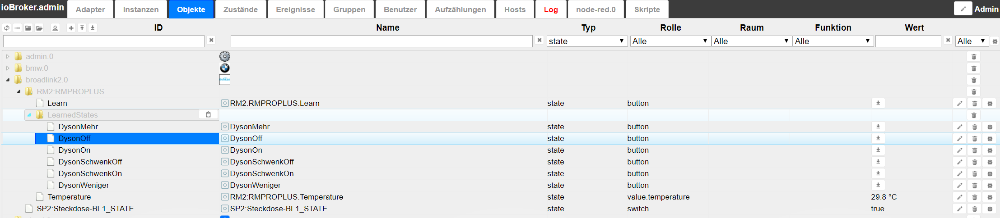

 
ioBroker.broadlink2  
==================

**Tests:** Linux/Mac: 
Windows: 

This is an ioBroker adapter for multiple  Broadlink devices like RM3, SP1, SP2, SP3,... .

## Configuration
??Enter the IP address in the configuration

## How-To learn codes
* In Objects of ioBroker you can find "broadlink.[n].enableLearningMode".
* Set this object to true. (e.g. on RM3 mini or Pro the LED is light up)
* Now press some button on your remote control within 30 seconds.
* An new Object should now appear within the Object "broadlink.[n].learnedSignals" with the name ">>> Learned, please describe"

It is also possible to use the codes from [RM-Bridge](http://rm-bridge.fun2code.de/).  
You just need to prepend "CODE_".

## How-To structure codes outside learnedSignals
* You can create your state object everywhere in the instance to build your own channel and device structure.
* All you need is the CODE_[n] from learnedSignals
* You can use the signal code (CODE_12345...) as object id or in name. Depends on what you prefer.

## Known-Issues
If you learn the same signal multiple times the code can be different everytime. This can not be changed.

## Changelog
### 0.2.0
* Implemented SP2 switches and they are working to set them!
* currently ONLY SP1 && SP2 (SP3?) are working, please test!
* Disabled RM? devices, no test available, ordered one for later re-implementation
