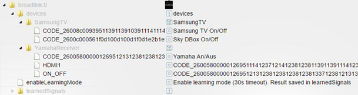

# ioBroker.broadlink
=============

This is an ioBroker adapter for Broadlink RM3 Mini/RM3 Pro to lean and send signals.

## Configuration
Enter the IP address in the configuration

## How-To learn codes
* In Objects of ioBroker you can find "broadlink.[n].enableLearningMode".
* Set this object to true. (e.g. on RM3 mini or Pro the LED is light up)
* Now press some button on your remote control within 30 seconds.
* An new Object should now appear within the Object "broadlink.[n].learnedSignals" with the name ">>> Learned, please describe"

## How-To structure codes outside learnedSignals
* You can create your state object everywhere in the instance to build your own channel and device structure.
* All you need is the CODE_[n] from learnedSignals
* You can use the signal code (CODE_12345...) as object id or in name. Depends on what you prefer.

## Known-Issues
If you learn the same signal multiple times the code can be different everytime. This can not be changed.

## TODO
* Add Tests
