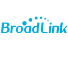

#  Steuert BroadLink IR/RF-Remotes und Schaltsteckdosen

**Tests:** Linux/Mac: 
Windows: 

## Adapter für verschiedene Broadlink WLan-Geräte (RM2++,SP1,SP2,SP3,...)
This is an ioBroker adapter for multiple  Broadlink switch like RM2, SP1, SP2, SP3, Honeywell SP2, SPMini, SPMini2, SPMiniPlus and some OEM products from them.
ALso remote controllers are supported like RM2, RM Mini, RM Pro Phicomm, RM2 Home Plus, RM2 Home Plus GDT, RM2 Pro Plus, RM2 Pro Plus2 and RM2 Pro Plus BL. Multiple controllers will generate their own entries and need to be trained separately.
It scans the network to find compatible devices and installs them (currently only switches type SP?).

If you learned states for RM* and then rename their name the state-ID will change to the new name as well!

You can create also your own new commands in LearnedStates if you use 'code'+ your code as the value (with 'CODE_' preceeding the code or even better (because of it will remain if you rename the state) add a field 'code' to native with the admin.object pencil and put there the hex code (without 'CODE_'!).

I could not test all of the possible devices because I have only a RM2 Pro Plus and some SM2.

### Note
SP1 devices cannot be polled.

* This adapter is based on original Broadlink adapter v0.1.1 found here: <https://github.com/hieblmedia/ioBroker.broadlink>

## Configuration
* Enter prefix of network address in configuration which should be removed when generating device names
* Enter the number of seconds between polls. On each poll all SP* devices expluding SP1 are asked what the switch status is. This feature can be disabled by setting the poll delay to 0. On some RM devices with temperature readout the temperature will be updated as well.

## How-To learn codes
* In Objects of ioBroker you can find "broadlink2.[n].[devicename].Learn".
* Set this object to true. (you can click on the button in object view)
* Now press some button on your remote control within 30 seconds.
* An new Object should now appear within the Object "broadlink.[n].[devicename].LearnedState" with the name ">>> Rename learned @ YYYYMMDDTHHmmSS"
* You can click on the button in object view to send the code.
* To rename the item click on the name (starting with `>>>`) and change the name. It should not include `,`, `.` or `;`

It is also possible to use the codes from [RM-Bridge](http://rm-bridge.fun2code.de/).
Just create an object (state, type button) with value where you prepend "CODE_" or with native entry `code` without any 'CODE_'.

## Use send messages to adapter

Der Adapter versteht jetzt auch 'sendTo' Kommandos. `sendTo('broadlink2.0','send','your device id')` würde den Wagen den sie auf 225xe umbenannt haben versperren, `sendTo('broadlink2.0','send','RM*:yourdev.Learn')` würde lernen starten und `sendTo('broadlink2.0','debug','on')` (es geht auch 0,1,on,off,ein,aus,true,false) würde debug ein- oder ausschalten. SP?-Steckdosen könen mit 'switch_on' und 'switch_off' anstatt 'send' ein oder ausgeschaltet werden wie z.B. `sendTo('broadlink2.0','switch_on','SP*:yourdev_STATE')`.
Mit `sendTo('broadlink2.0','get', 'RM2:RMPROPLUS.Temperature'` kann der state von Werten abgefragt werden, man bekommt z.B. `{ val: 29.9, ack: true, ts: 1505839335870, q: 0, from: 'system.adapter.broadlink2.0', lc: 1505839335870 }` zurück.

## Known-Issues
* If you learn the same signal multiple times the code can be different everytime. This can not be changed.
* Sometimes it does not find devices if they do not respond to the search. Do a rescan or restart adapter to restart a new instance.

## Important/Wichtig
* Requires node >=v4.2

## Changelog
### 1.1.1
* Added ***NewDeviceScan***-Button um einen neuen scan zu veranlassen ohne den Adapter zu starten.
* Adapter lest sofort die Werte der Devices ein
* Problem solved which occured when multiple IP names were resolved by reverse-dns.

### 1.1.0
* Support for A1 devices added (thanks a lot to **blackrozes**)
* bug fix for SP?
* Receive and execute message from sendTo to broadlink2 implemented

### 1.0.3
* Renamed to ioBroker.broadlink2 on Git
* Bug fix on 1.0.1

### 1.0.0
* Added learned state renaming, just rename the name and the ID will be renamed as well.
* Added debugging with 'debug!' at beginning of IP suffix and you will see debug messages without setting Adapter to debug.

### 0.4.4
* Don't create substates for switches
* Problem with tests resolved

### 0.4.2
* Changed message to inform about found devices.
* Moved device info from  custom to native to avoid blue mark in adapter object list.

### 0.4.1
* Cleaned up code
* Debug and Info messages corrected

### 0.3.5
* Small bugs for node 4.x removed
* Poll more devices and some better debug code.
* first RM2++ device integration with learning!

### 0.3.0
* Poll frequency can be set to check the switches (which are able to do so, SM2 for example) and change the state if they are  changed by the user on the device.

### 0.2.1
* Changed naming convention and used type:name instead of type.name to reduce ioBroker subdivision of devices
* generate device object only if device is a remote control

### 0.2.0
* Implemented SP2 switches and they are working to set them!
* Currently ONLY SP1 && SP2 (SP3?) are working, please test!
* Disabled RM? devices, no test available, ordered one for later re-implementation

## Configuration

Der Benutzername, das Passwort und die Datenfilter müssen im Adapter config eingegeben werden.

### Todo for later revisions

## Installation

Mit ioBroker admin, npm install iobroker.broadlink2 oder von <https://github.com/frankjoke/ioBroker.broadlink2> 

## License

The MIT License (MIT)

Copyright (c) 2014-2016, bluefox <dogafox@gmail.com>

Permission is hereby granted, free of charge, to any person obtaining a copy
of this software and associated documentation files (the "Software"), to deal
in the Software without restriction, including without limitation the rights
to use, copy, modify, merge, publish, distribute, sublicense, and/or sell
copies of the Software, and to permit persons to whom the Software is
furnished to do so, subject to the following conditions:

The above copyright notice and this permission notice shall be included in
all copies or substantial portions of the Software.

THE SOFTWARE IS PROVIDED "AS IS", WITHOUT WARRANTY OF ANY KIND, EXPRESS OR
IMPLIED, INCLUDING BUT NOT LIMITED TO THE WARRANTIES OF MERCHANTABILITY,
FITNESS FOR A PARTICULAR PURPOSE AND NONINFRINGEMENT. IN NO EVENT SHALL THE
AUTHORS OR COPYRIGHT HOLDERS BE LIABLE FOR ANY CLAIM, DAMAGES OR OTHER
LIABILITY, WHETHER IN AN ACTION OF CONTRACT, TORT OR OTHERWISE, ARISING FROM,
OUT OF OR IN CONNECTION WITH THE SOFTWARE OR THE USE OR OTHER DEALINGS IN
THE SOFTWARE.
