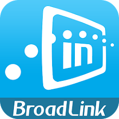

#  Steuert BroadLink kompatible Geräte

[English manual - Englische Anleitung](README.md)

## Adapter für verschiedene Broadlink WLan-Geräte (RM++,SP++,A1, Floureon, S1C)

Dieser ioBroker adapter für die meisten Broadlink kompatiblen Geräte wie RM++, SP1, SP2, SP3, Honeywell SP2, SPMini, SPMini2, SPMiniPlus A1AIR und einige OEM Versionen. Die neueste Version kennt auch S1C Sicherheitstechnik und Floureon/Beok313 Thermostate.
Natürlich werden Fernsteuerungen wie RM2, RM Mini, RM Pro Phicomm, RM2 Home Plus, RM2 Home Plus GDT, RM2 Pro Plus, RM2 Pro Plus2 und RM2 Pro Plus BL unterstützt. Die Fernsteuerungen können Befehle lernen welche dann mit ioBroker gesendet werden können.

Neue angelerne Befehle können umbenannt werden, Dabei wird auch der Befehls-ID umbenannt.

Man kann auch eigene Einträge erzeugen indem man sie entweder 'CODE_'+code nennt oder unter AdminObjekte mittels dem Bleistift im 'nativ'-Bereich einen Eintrag `code` mit dem code (ohne _CODE voran) generierst, Allerdings müssen all diese im `.L.` Verzeichnis sein.

Man kann Szenen bilden weche dann Mehrere Befehle hintereinander auszuführen. 

This is an ioBroker adapter for multiple  Broadlink switch like RM2, RM3, RM Plus, SP1, SP2, SP3, Honeywell SP2, SPMini, SPMini2, SPMiniPlus and some OEM products from them.
ALso remote controllers are supported like RM2, RM Mini, RM Pro Phicomm, RM2 Home Plus, RM2 Home Plus GDT, RM2 Pro Plus, RM2 Pro Plus2 and RM2 Pro Plus BL. Multiple controllers will generate their own entries and need to be trained separately.
It scans the network to find compatible devices and installs them (currently only switches type SP?).

If you learned states for RM* and then rename their name the state-ID will change to the new name as well!

You can create also your own new commands in LearnedStates if you use 'code'+ your code as the value (with 'CODE_' preceeding the code or even better (because of it will remain if you rename the state) add a field 'code' to native with the admin.object pencil and put there the hex code (without 'CODE_'!).

The adapter has fixed states to send codes from RM-devices or to learn them It can also send individual scenes (actions on multiple devices).

If devices which are configured on a certain IP are not found again they will be flagged 'notReachable'! If they are connected again they will be useable normally.

If a device is not answering 2 times in a row it's set to unreachable. ***notReachable*** devices will give a log warning message every 50 scans. After 10 scans the adapter will try to find them again on the same IP like before. If you changed IP please do a rescan.

Please delete devices from admin.objects in case you remove them permanentely or renamed them in your router!

### Note

SP1-Geräte können nicht abgefragt werden!

## Configuration

* Enter prefix of network address in configuration which should be removed when generating device names
* Enter the number of seconds between polls. On each poll all SP* devices expluding SP1 are asked what the switch status is. This feature can be disabled by setting the poll delay to 0. On some RM devices with temperature readout the temperature will be updated as well.

## How-To learn codes

* In Objects of ioBroker you can find "broadlink2.[devicename].Learn or LearnRF for '+' type of devices".
* For RM(x)+ (Plus) devices you get also a special RS-sweep-lear button which can learn more devices than on normal 433MHz.
* Set this object to true. (you can click on the button in object view)
* Now press some button on your remote control within 30 seconds.
* An new Object should now appear within the Object "broadlink.[n].[devicename].LearnedState" with the name ">>> Rename learned @ YYYYMMDDTHHmmSS"
* You can click on the button in object view to send the code.
* To rename the item click on the name (starting with `>>>`) and change the name. It should not include `,`, `.` or `;`

It is also possible to use the codes from [RM-Bridge](http://rm-bridge.fun2code.de/).
Just create an object (state, type button) with value where you prepend "CODE_" or with native entry `code` without any 'CODE_'.

## Use scenes

* Szenen bestehen aus ID's oder Zahlen mit `,` aneinandergereiht. Normal werden sie einfach im Abstand von 100ms hintereinander ausgelöst. Wird eine Zahl gefunden wird dort so viele ms gewartet bis zum nächsten Auslösen. Also `,SP:dose1, RM:your.L.StereoEin, 1000, RM:your.L.TVEin` würde die Steckdose einschalten, dann den Fernseher  1100ms nachher die Stereoanlage. Man kann auch Werte bei anderen (auch fremde) States durch Angabe des kompletten id's schalten: `hm-rpc.0.MEQ1435726.1.STATE` würde diesen einschalten! Übrigens, Bei boolschen Stateskann kann beim Einschalten das '=1/=on/=true/=ein' weggelassen werden da true der default-Wert ist. Beim Ausschalten wäre ein '=0/=false/=aus/=off' undbedingt notwendig!

## Use states

* Sie können states anlegen welche mittels gelernten Signale ein- oder ausgeschaltet werden.
* Damit geben sie den State-Namen an und die Signale (listem mit ',' getrennt) die das Gerät einschalten und auch solche die es ausschalten.
* Bei boolschen States wird nur der erste Wert gesendet aber beim Senden von allen Werten wird der State gesetzt. Das ist von Vorteil wenn mehrere Tasten ein Gerät einschalten (oder Ausschalten)
* Es kännen zum Ausschalten auch keine Signale gelistet werden dann werden die zum Einschalten verwendeten Werte in einer Liste
* wird als Aus-Signal nur '+' angegeben werden die Werte im Ein-Bereich (hoffentlich 10 Signale) als Zehnertastatur verwendet die Wete bis zu 9999 senden kann. Wenn dann der State mit Wert 123 beschrieben wird wird dann '1' , '2' und dann '3' mit jeweils nach 1/3 Sekunde Verzögerung gesendet!

Die Liste muss mit dem 0-Befehl beginnen und mit dem 9-Befehl enden!

## Use send messages to adapter

Der Adapter versteht jetzt auch 'sendTo' Kommandos.

* `debug`: `sendTo('broadlink2.0','debug','on')` (es geht auch 0,1,on,off,ein,aus,true,false) würde debug ein- oder ausschalten.
* `get`:  `sendTo('broadlink2.0','get', 'RM2:RMPROPLUS.Temperature'` kann der state von Werten abgefragt werden, man bekommt z.B. `{ val: 29.9, ack: true, ts: 1505839335870, q: 0, from: 'system.adapter.broadlink2.0', lc: 1505839335870 }` zurück
* `switch`: schaltet Steckdose ein/aus je nach Text: `sendTo('broadlink2.0','switch','SP:your device id=on')`
* `switch_on`/`switch_off`:  sendTo('broadlink2.0','switch_on','SP:your device id')`
* `send`: `sendTo('broadlink2.0','send','RM:yourdev.Learn')` würde lernen starten und `sendTo('broadlink2.0','send','RM:yourdev.L.yourid')` würde den code (oder eine Scene) senden.
* `send_scene`: `sendTo('broadlink2.0','send_scene','scene xxx ')` würde den als message angegebenen Text als Szene ausführen
* `send_code`: `sendTo('broadlink2.0','send_code','RM:your remote.CODE_xxxxx')` würde den CODE_xxxx vom R:your name senden.

## Floureon or Beok313 Thermostats

* Sie meisten States können beschrieben werden. Die Uhrzeit kann mit einem Schreiben auf `_setTime` auf die ioBroker Systemzeit gesetzt werden. Das passiert auch automatisch bei Adapter-Start.

## Config additional dnew devices

* Falls sie ein neues Gerät einbinden welches der Adapter noch nicht kennt wobei sie aber wissen dass es mit einem der Gerätetypen kompatible ist können sie es in der Konfig eintragen. Sie brauchen dazu den device-id (in hex oder dezimal) und die Klasse des Geätes (wie  = A1,MP1,RM,RMP,S1C,SP1,SP2,SP3P,T1). Mit dem  device ID von 0x1234 kann ein RM Plus mit `0x01234=RMP` hinzugefügt werden. 

## Rename devices

* Die Geräte werden normalerweise nach ihrem Host-Namen benannt (den sie selbst bei der Anmeldung angeben), falls das nicht der Fall ist wird eine Kombination aus Geräte-Type, ID und Mac Addresse Verwendet. Es werden die ersten 2 Buchstaben der Type mit ':' vorangestellt. Sie können das auf andere Namen umbenennen wenn sie z.B. `T1:BroadLink-OEM-T1-fa-83-7c=Beok313` ins Umbenenne-Feld der Konfiguration schreiben, der Name 'T1:BroadLink-OEM-T1-fa-83-7c' würde dann nicht verwendet und durch  `Beok313` ersetzt werden.

## Debug Modus

* Wenn sie ans Ende der hinzuzufüghenden Geräte ein `!` schreiben (auch bei leerer Liste) dann wird der Adapter Debug-Meldungen loggen auch wenn er im Admin auf 'info' gesetzt ist.

## Known-Issues

* Die Codes bei mehrmaligen Lernen von den selben Tasten können unterschiedlich sein!
* Manchmal können Geräte nicht gefunden werden da sie die Wlan-Verbindung verlogen wurde. Sie werden vom Adapter selbständig wieder gesucht aber können während der Abwesenheit nicht bediehnt werden.

## Important/Wichtig

* Der Adapter braucht Nodejs Version >=V6

## Changelog

### 2.0.0

* Can handle Floureon/Beko thermostats (now with MQTT)
* Can handle S1C security devices
* Names device after their name or with their mac to reduce possibility of renaming
* Can rename devices
* Can add device Id's/Types for new devices
* New communication routines to find & re-find devices
* New communication protocoll with devices which do not allow that devices can get commands from 2 sources intermixed

### 1.9.1
* added anothe RM Mini code

### 1.8.1
* Changed util.js and tests and added new devices

### Todo for later revisions
* config of devices and codes

## Installation

Mit ioBroker admin, npm install iobroker.broadlink2 oder von <https://github.com/frankjoke/ioBroker.broadlink2>

## License

The MIT License (MIT)

Copyright (c) 2014-2019 Frank Joke <frankjoke@hotmail.com>

Permission is hereby granted, free of charge, to any person obtaining a copy
of this software and associated documentation files (the "Software"), to deal
in the Software without restriction, including without limitation the rights
to use, copy, modify, merge, publish, distribute, sublicense, and/or sell
copies of the Software, and to permit persons to whom the Software is
furnished to do so, subject to the following conditions:

The above copyright notice and this permission notice shall be included in
all copies or substantial portions of the Software.

THE SOFTWARE IS PROVIDED "AS IS", WITHOUT WARRANTY OF ANY KIND, EXPRESS OR
IMPLIED, INCLUDING BUT NOT LIMITED TO THE WARRANTIES OF MERCHANTABILITY,
FITNESS FOR A PARTICULAR PURPOSE AND NONINFRINGEMENT. IN NO EVENT SHALL THE
AUTHORS OR COPYRIGHT HOLDERS BE LIABLE FOR ANY CLAIM, DAMAGES OR OTHER
LIABILITY, WHETHER IN AN ACTION OF CONTRACT, TORT OR OTHERWISE, ARISING FROM,
OUT OF OR IN CONNECTION WITH THE SOFTWARE OR THE USE OR OTHER DEALINGS IN
THE SOFTWARE.
